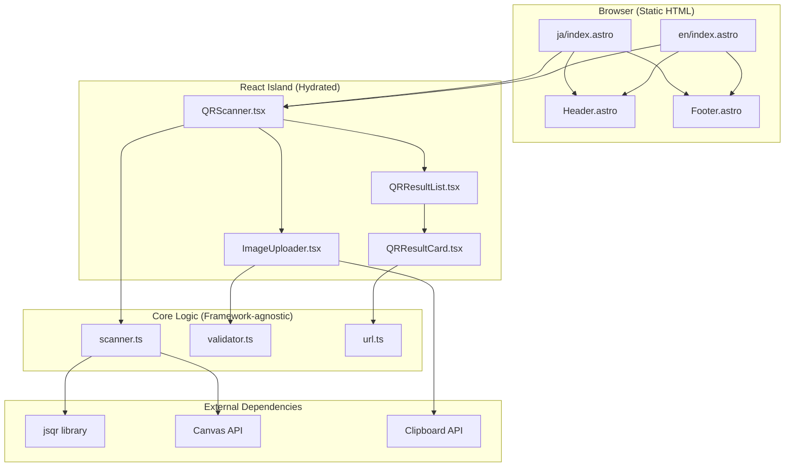
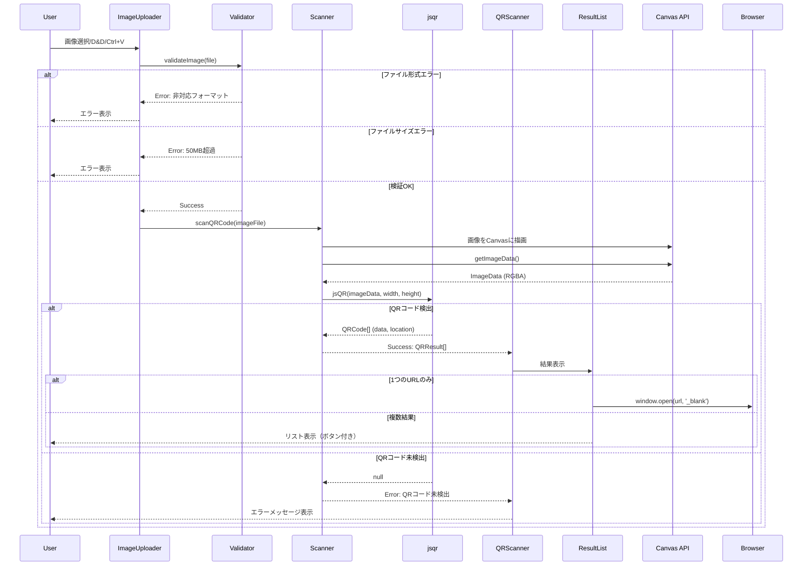
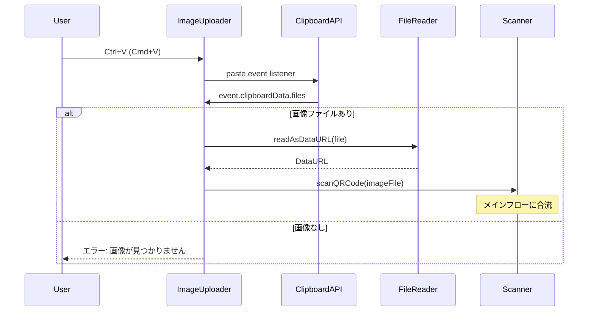

# Technical Design Document - SnapQR2Link

## Overview

SnapQR2Linkは、スクリーンショット内のQRコードをブラウザ内で解析し、URLへ即座にアクセスできる軽量Webアプリケーションです。Astroのアイランドアーキテクチャを活用して静的コンテンツとインタラクティブコンポーネントを分離し、初期ロードを50-100KB程度に抑えながら高速なユーザー体験を提供します。

**Purpose**: カメラ不要でスクリーンショット内のQRコードを読み取り、リンクへ即座にアクセスする機能を提供します。すべての画像処理はクライアントサイドで完結し、プライバシーを保護します。

**Users**: リモートワーカー、Zoom招待などのQRコードをPC画面で受け取るユーザー、スクリーンショット保存済みのQRコードを後から開きたいユーザーが対象です。

**Impact**: 新規プロジェクト（greenfield）のため、既存システムへの影響はありません。

### Goals

- スクリーンショットやクリップボードからQRコードを検出・解析
- URLが1つの場合は自動的に新しいタブで開く
- 複数QRコードまたはテキストデータに対応
- 初期ページロード100KB以下、QRコード解析3秒以内
- 日本語・英語の多言語対応とSEO最適化
- WCAG 2.1レベルA準拠のアクセシビリティ

### Non-Goals

- PDF形式のサポート（将来的な拡張機能として検討）
- サーバーサイド処理や外部APIへの画像送信
- QRコード生成機能
- カメラ撮影による直接読み取り（初期バージョン）
- 履歴・お気に入り機能（初期バージョン）

## Architecture

### Architecture Pattern & Boundary Map

**選択パターン**: Astro アイランドアーキテクチャ



**Architecture Integration**:
- **選択パターン**: アイランドアーキテクチャ（静的HTML + React島）
- **Domain/Feature Boundaries**:
  - **静的コンテンツ層**: Astroコンポーネント（ヘッダー、フッター、レイアウト）- JSなし
  - **インタラクティブ層**: Reactコンポーネント（QRスキャナー、画像アップロード）- client:load
  - **ビジネスロジック層**: フレームワーク非依存TypeScript（QRコード解析、バリデーション）
- **Existing Patterns Preserved**: N/A（新規プロジェクト）
- **New Components Rationale**:
  - **QRScanner**: 中核となるオーケストレーションコンポーネント、状態管理
  - **ImageUploader**: 画像入力インターフェース（ファイル選択、D&D、ペースト）
  - **scanner.ts**: jsqrライブラリのラッパー、Canvas API統合
  - **ResultList/ResultCard**: QRコード検出結果の表示と操作
- **Steering Compliance**:
  - TypeScript strict mode、`any`型禁止
  - Pages → Layouts → Components → Lib の依存方向遵守
  - 機能ごとのディレクトリ分け（`/qr`、`/i18n`）

### Technology Stack

| Layer | Choice / Version | Role in Feature | Notes |
|-------|------------------|-----------------|-------|
| **Frontend / Framework** | Astro 4.x | 静的サイト生成、ルーティング、i18n | アイランドアーキテクチャによる軽量化 |
| **UI Library** | React 18.x | インタラクティブコンポーネント（島） | QRスキャナー、画像アップロード |
| **Language** | TypeScript 5.x | 型安全性、strict mode | `any`型禁止、完全型定義 |
| **Styling** | TailwindCSS 4.x | ユーティリティファーストCSS（Oxide Engine） | レスポンシブ対応、高速ビルド、未使用クラス削除 |
| **QR Detection** | jsqr 1.4.0 | QRコード検出・解析 | Canvas API ImageData処理、軽量（~50KB） |
| **Browser APIs** | Canvas API, Clipboard API | 画像処理、ペースト機能 | ブラウザネイティブ、無料 |
| **Testing** | Vitest, Playwright | ユニット・E2Eテスト | Astro推奨スタック |
| **Build Tool** | pnpm | パッケージ管理、ビルド | ディスク効率、厳密な依存管理 |
| **Hosting** | GitHub Pages / Cloudflare Pages | 静的ホスティング | CDN配信、CI/CD連携 |

**Rationale**:
- **Astro**: SEO重視・軽量性重視の要件に最適、静的HTML生成とReact島の併用
- **jsqr**: QRコード専用で軽量（~50KB）、シンプルなAPI、TypeScript対応
- **TailwindCSS**: Astro公式統合、レスポンシブ設計が容易、未使用クラス削除でバンドル最小化
- 詳細な調査結果は`research.md`参照

## System Flows

### メインフロー: 画像アップロードからQRコード検出まで



**Key Decisions**:
- ファイルバリデーションを先行実施（形式・サイズチェック）
- QRコード検出結果が1つのURLの場合、自動的に新しいタブで開く
- 複数結果またはURL以外のテキストの場合、ユーザーが選択可能なリスト表示

### クリップボードペーストフロー



## Requirements Traceability

| Requirement | Summary | Components | Interfaces | Flows |
|-------------|---------|------------|------------|-------|
| 1.1 | ファイル選択ボタン | ImageUploader | FileInputProps | メインフロー |
| 1.2 | ドラッグ&ドロップ | ImageUploader | DragDropProps | メインフロー |
| 1.3 | Ctrl+V ペースト | ImageUploader | ClipboardPasteProps | クリップボードペーストフロー |
| 1.4 | JPG/PNG/WebP/GIF対応 | Validator | validateImage() | メインフロー |
| 1.5 | PDF非対応 | Validator | validateImage() | メインフロー |
| 1.6 | フォーマットエラー表示 | ImageUploader | ErrorMessage | メインフロー |
| 1.7 | 50MB制限 | Validator | validateImage() | メインフロー |
| 2.1 | Canvas API使用 | Scanner | scanQRCode() | メインフロー |
| 2.2 | ローディング表示 | QRScanner | LoadingState | メインフロー |
| 2.3 | jsqr使用 | Scanner | scanQRCode() | メインフロー |
| 2.4 | 全QRコード検出 | Scanner | scanQRCode() | メインフロー |
| 2.5 | QRコードデコード | Scanner | scanQRCode() | メインフロー |
| 2.6 | 複数QRコード表示 | ResultList | QRResultListProps | メインフロー |
| 2.7 | 未検出エラー表示 | QRScanner | ErrorMessage | メインフロー |
| 2.8 | クライアントサイド完結 | 全コンポーネント | N/A | 全フロー |
| 3.1 | カード形式表示 | ResultCard | QRResultCardProps | メインフロー |
| 3.2 | 1つのURL自動オープン | ResultList | autoOpenURL() | メインフロー |
| 3.3 | 複数結果ボタン表示 | ResultList, ResultCard | QRResultListProps | メインフロー |
| 3.4 | リンクを開くボタン | ResultCard | openURL() | メインフロー |
| 3.5 | コピーボタン | ResultCard | copyToClipboard() | メインフロー |
| 3.6 | コピー確認メッセージ | ResultCard | Toast | メインフロー |
| 3.7 | クリアボタン | QRScanner | clearResults() | メインフロー |
| 4.1-4.5 | 多言語対応（日・英） | Pages, i18n | getI18n() | N/A |
| 5.1-5.4 | レスポンシブUI | 全UIコンポーネント | TailwindCSS | N/A |
| 6.1-6.6 | アクセシビリティ | 全UIコンポーネント | ARIA属性 | N/A |
| 7.1-7.6 | SEO対策 | Pages, Layouts | MetaTags | N/A |
| 8.1-8.4 | パフォーマンス | アーキテクチャ全体 | N/A | N/A |
| 9.1-9.5 | プライバシー保護 | 全コンポーネント | N/A | 全フロー |
| 10.1-10.4 | デプロイメント | ビルド設定 | astro.config.mjs | N/A |

## Components and Interfaces

### Component Summary

| Component | Domain/Layer | Intent | Req Coverage | Key Dependencies (P0/P1) | Contracts |
|-----------|--------------|--------|--------------|--------------------------|-----------|
| QRScanner | UI/React島 | QRスキャン機能のオーケストレーション、状態管理 | 2, 3 | Scanner (P0), ImageUploader (P0), ResultList (P0) | State |
| ImageUploader | UI/React島 | 画像入力インターフェース（ファイル、D&D、ペースト） | 1 | Validator (P0), Clipboard API (P0) | Event |
| ResultList | UI/React島 | QRコード検出結果リスト表示、自動オープン制御 | 3 | ResultCard (P0), URLUtil (P1) | Service |
| ResultCard | UI/React島 | 個別QRコード結果カード、ボタン操作 | 3 | URLUtil (P1), Clipboard API (P1) | Service |
| Scanner | Logic/Lib | QRコード検出・解析ロジック | 2 | jsqr (P0), Canvas API (P0) | Service |
| Validator | Logic/Lib | 画像ファイルバリデーション | 1 | なし | Service |
| URLUtil | Logic/Lib | URL検証・整形 | 3 | なし | Service |
| BaseLayout | Layout/Astro | 基本レイアウト（HTML構造、メタタグ） | 7 | なし | N/A |
| MainLayout | Layout/Astro | メインレイアウト（ヘッダー、フッター） | 5, 6 | Header, Footer (P0) | N/A |
| Header | Layout/Astro | ヘッダーコンポーネント | 4, 5 | i18n (P1) | N/A |
| Footer | Layout/Astro | フッターコンポーネント | 4, 5 | i18n (P1) | N/A |

### React Island / UI Layer

#### QRScanner

| Field | Detail |
|-------|--------|
| Intent | QRスキャン機能のメインオーケストレーター、状態管理、エラーハンドリング |
| Requirements | 2.2, 2.7, 3.7 |

**Responsibilities & Constraints**
- 画像アップロードから結果表示までのフロー制御
- ローディング状態、エラーメッセージの表示管理
- 検出結果のクリア機能
- QRコード検出結果の状態管理（複数QRコード対応）

**Dependencies**
- Inbound: なし（最上位コンポーネント）
- Outbound: ImageUploader, ResultList — UI表示 (P0)
- External: Scanner — QRコード検出ロジック (P0)

**Contracts**: State [x]

##### State Management

```typescript
interface QRScannerState {
  results: QRResult[];
  isLoading: boolean;
  error: string | null;
}

interface QRResult {
  data: string;
  type: 'url' | 'text';
  location?: {
    topLeftCorner: Point;
    topRightCorner: Point;
    bottomRightCorner: Point;
    bottomLeftCorner: Point;
  };
}

interface Point {
  x: number;
  y: number;
}
```

- **Preconditions**: なし
- **Postconditions**: results配列が更新され、ResultListに反映される
- **Invariants**: isLoadingとresultsは相互排他的（ローディング中はresultsはクリアされる）

**Implementation Notes**
- **Integration**: `client:load`ディレクティブで即座にハイドレート
- **Validation**: Scanner.scanQRCode()のエラーハンドリング、タイムアウト設定（3秒）
- **Risks**: 大容量画像処理時のメモリ不足 → 画像リサイズ処理を追加検討

#### ImageUploader

| Field | Detail |
|-------|--------|
| Intent | 画像入力インターフェース（ファイル選択、D&D、Ctrl+Vペースト） |
| Requirements | 1.1, 1.2, 1.3, 1.6, 1.7 |

**Responsibilities & Constraints**
- ファイル選択ダイアログのトリガー
- ドラッグ&ドロップイベントハンドリング
- Ctrl+V（Cmd+V）ペーストイベントハンドリング
- Validatorによるファイルバリデーション
- エラーメッセージの表示

**Dependencies**
- Inbound: QRScanner — onImageUpload callback (P0)
- Outbound: Validator — validateImage() (P0)
- External: Clipboard API — paste event (P0)

**Contracts**: Event [x]

##### Event Contract

```typescript
interface ImageUploaderProps {
  onImageUpload: (file: File) => void;
  onError: (error: string) => void;
}

interface ImageUploadEvent {
  file: File;
  source: 'file-picker' | 'drag-drop' | 'paste';
}
```

- **Preconditions**: ユーザーがファイル選択、D&D、またはCtrl+Vを実行
- **Postconditions**: 有効な画像ファイルがonImageUploadコールバックで親に渡される
- **Invariants**: バリデーションエラー時はonErrorコールバックが呼ばれ、onImageUploadは呼ばれない

**Implementation Notes**
- **Integration**: Clipboard API `paste`イベントリスナー、`event.clipboardData.files`から画像取得
- **Validation**: Validator.validateImage()で形式・サイズチェック、エラーメッセージ多言語対応
- **Risks**: ブラウザのClipboard API権限エラー → フォールバック処理なし（pasteイベントは権限不要）

#### ResultList

| Field | Detail |
|-------|--------|
| Intent | QRコード検出結果のリスト表示、1つのURL自動オープン制御 |
| Requirements | 2.6, 3.2, 3.3 |

**Responsibilities & Constraints**
- QRResult配列を受け取り、ResultCardをレンダリング
- 結果が1つのURLのみの場合、自動的に`window.open(url, '_blank')`
- 複数結果またはURL以外のテキストの場合、リスト表示

**Dependencies**
- Inbound: QRScanner — results prop (P0)
- Outbound: ResultCard — QRResult渡し (P0)
- External: URLUtil — isValidURL() (P1)

**Contracts**: Service [x]

##### Service Interface

```typescript
interface ResultListProps {
  results: QRResult[];
  locale: 'ja' | 'en';
}

function autoOpenURL(results: QRResult[]): void {
  if (results.length === 1 && results[0].type === 'url') {
    window.open(results[0].data, '_blank');
  }
}
```

- **Preconditions**: results配列が非null、URLUtilでtype判定済み
- **Postconditions**: 1つのURL結果なら新しいタブで自動オープン、それ以外はリスト表示
- **Invariants**: autoOpenURL()は一度だけ実行される（useEffectでresults変更時）

**Implementation Notes**
- **Integration**: useEffect()でresults変更を監視、autoOpenURL()を条件実行
- **Validation**: URLUtil.isValidURL()でURL判定、http/https スキーム確認
- **Risks**: ポップアップブロッカーによるwindow.open()失敗 → フォールバック処理追加（手動ボタン表示）

#### ResultCard

| Field | Detail |
|-------|--------|
| Intent | 個別QRコード結果のカード表示、ボタン操作（リンクを開く、コピー） |
| Requirements | 3.1, 3.4, 3.5, 3.6 |

**Responsibilities & Constraints**
- QRResultをカード形式で表示
- URLの場合「リンクを開く」ボタン、テキストの場合「コピー」ボタン
- コピー成功時のToast表示

**Dependencies**
- Inbound: ResultList — QRResult prop (P0)
- Outbound: URLUtil — isValidURL() (P1)
- External: Clipboard API — writeText() (P1)

**Contracts**: Service [x]

##### Service Interface

```typescript
interface ResultCardProps {
  result: QRResult;
  locale: 'ja' | 'en';
  onCopySuccess?: () => void;
}

function openURL(url: string): void {
  window.open(url, '_blank');
}

function copyToClipboard(text: string): Promise<void> {
  return navigator.clipboard.writeText(text);
}
```

- **Preconditions**: result.data が非null
- **Postconditions**: URLオープンまたはクリップボードコピー成功、Toastが短時間表示
- **Invariants**: ボタンは1つのみ表示（URLかテキストかで排他的）

**Implementation Notes**
- **Integration**: TailwindCSSでカードスタイリング、ボタンにaria-label追加（アクセシビリティ）
- **Validation**: copyToClipboard()のPromise catch でエラーハンドリング
- **Risks**: navigator.clipboard.writeText()のブラウザ互換性 → フォールバック処理（document.execCommand('copy')）

### Logic / Lib Layer

#### Scanner

| Field | Detail |
|-------|--------|
| Intent | QRコード検出・解析のコアロジック、jsqrライブラリのラッパー |
| Requirements | 2.1, 2.3, 2.4, 2.5, 2.8 |

**Responsibilities & Constraints**
- Canvas APIで画像をImageDataに変換
- jsqrライブラリでQRコード検出
- 複数QRコード対応（画像の異なる領域を走査）
- type判定（URL or テキスト）

**Dependencies**
- Inbound: QRScanner, ImageUploader — scanQRCode() call (P0)
- Outbound: なし
- External: jsqr — jsQR(imageData, width, height) (P0), Canvas API (P0)

**Contracts**: Service [x]

##### Service Interface

```typescript
interface ScanOptions {
  inversionAttempts?: 'attemptBoth' | 'dontInvert' | 'onlyInvert' | 'invertFirst';
  maxWidth?: number;  // 画像リサイズの最大幅（デフォルト: 4000px）
  maxHeight?: number; // 画像リサイズの最大高さ（デフォルト: 4000px）
}

function scanQRCode(
  imageFile: File,
  options?: ScanOptions
): Promise<QRResult[]> {
  // Canvas APIで画像をロード
  // 必要に応じてリサイズ
  // getImageData()でピクセルデータ取得
  // jsQR()で検出
  // 複数QRコード対応（画像の異なる領域を走査）
  // type判定（isValidURL()でURL判定）
  // QRResult[]を返す
}

function isQRCodeURL(data: string): boolean {
  return /^https?:\/\//i.test(data);
}
```

- **Preconditions**: imageFileが有効な画像形式（JPG/PNG/WebP/GIF）
- **Postconditions**: QRResult配列を返す（未検出時は空配列）
- **Invariants**: Canvas APIとjsqrはブラウザ内で動作、外部通信なし

**Implementation Notes**
- **Integration**: FileReaderで画像をDataURL読み込み、Imageオブジェクト経由でCanvasに描画
- **Validation**: 画像サイズが4000x4000pxを超える場合、比率維持してリサイズ
- **Risks**: jsqrの検出精度が不十分 → `inversionAttempts: 'attemptBoth'`オプション、検出失敗時のユーザーガイダンス

#### Validator

| Field | Detail |
|-------|--------|
| Intent | 画像ファイルのバリデーション（形式、サイズ） |
| Requirements | 1.4, 1.5, 1.6, 1.7 |

**Responsibilities & Constraints**
- ファイル形式チェック（JPG/PNG/WebP/GIF）
- ファイルサイズチェック（50MB制限）
- バリデーションエラーメッセージ生成

**Dependencies**
- Inbound: ImageUploader — validateImage() call (P0)
- Outbound: なし
- External: なし

**Contracts**: Service [x]

##### Service Interface

```typescript
interface ValidationResult {
  isValid: boolean;
  error?: string;
}

const SUPPORTED_FORMATS = ['image/jpeg', 'image/png', 'image/webp', 'image/gif'];
const MAX_FILE_SIZE = 50 * 1024 * 1024; // 50MB

function validateImage(file: File): ValidationResult {
  if (!SUPPORTED_FORMATS.includes(file.type)) {
    return {
      isValid: false,
      error: 'このファイル形式はサポートされていません（JPG、PNG、WebP、GIFのみ対応）',
    };
  }

  if (file.size > MAX_FILE_SIZE) {
    return {
      isValid: false,
      error: 'ファイルサイズが大きすぎます（最大50MB）',
    };
  }

  return { isValid: true };
}
```

- **Preconditions**: fileがFileオブジェクト
- **Postconditions**: ValidationResultを返す、エラーメッセージは多言語対応
- **Invariants**: SUPPORTED_FORMATSとMAX_FILE_SIZEは定数

**Implementation Notes**
- **Integration**: エラーメッセージはi18n辞書から取得（多言語対応）
- **Validation**: file.typeとfile.sizeのみ使用、実際の画像解析はScannerで実施
- **Risks**: MIMEタイプ偽装 → Scannerでの画像ロード失敗をキャッチ

#### URLUtil

| Field | Detail |
|-------|--------|
| Intent | URL検証・整形ユーティリティ |
| Requirements | 3.1, 3.2, 3.4 |

**Responsibilities & Constraints**
- URL形式の検証（http/httpsスキーム）
- URLの正規化・整形

**Dependencies**
- Inbound: ResultList, ResultCard — isValidURL() call (P1)
- Outbound: なし
- External: なし

**Contracts**: Service [x]

##### Service Interface

```typescript
function isValidURL(data: string): boolean {
  try {
    const url = new URL(data);
    return url.protocol === 'http:' || url.protocol === 'https:';
  } catch {
    return false;
  }
}

function normalizeURL(url: string): string {
  // URLの正規化（末尾スラッシュ削除等）
  return url.trim();
}
```

- **Preconditions**: data が文字列
- **Postconditions**: boolean（URL形式かどうか）
- **Invariants**: URL()コンストラクタの例外処理

**Implementation Notes**
- **Integration**: ブラウザネイティブのURL APIを使用
- **Validation**: http/httpsのみ許可、その他のスキーム（ftp、file等）は拒否
- **Risks**: なし（シンプルなユーティリティ）

### Layout / Astro Layer

#### BaseLayout

| Field | Detail |
|-------|--------|
| Intent | 基本レイアウト（HTML構造、メタタグ、SEO設定） |
| Requirements | 7.1, 7.2, 7.3, 7.4, 7.5 |

**Responsibilities & Constraints**
- `<html>`、`<head>`、`<body>`の基本構造
- メタタグ（title、description、OGP）
- hreflangメタタグ（日本語・英語）
- セマンティックHTML（`<header>`、`<main>`、`<footer>`）

**Implementation Notes**
- **Integration**: Astroの`<slot />`で子コンテンツを挿入
- **Validation**: 各ページでpropsとしてtitle、description、locale等を受け取る
- **Risks**: なし（静的コンポーネント）

#### MainLayout

| Field | Detail |
|-------|--------|
| Intent | メインレイアウト（ヘッダー、フッター含む） |
| Requirements | 4.1, 4.2, 5.1, 5.2, 6.2, 6.3 |

**Responsibilities & Constraints**
- BaseLayoutを継承
- Header、Footerコンポーネントの配置
- レスポンシブグリッドレイアウト（TailwindCSS）

**Implementation Notes**
- **Integration**: TailwindCSSの`container`、`mx-auto`でセンタリング
- **Validation**: なし（静的コンポーネント）
- **Risks**: なし

#### Header / Footer

| Field | Detail |
|-------|--------|
| Intent | ヘッダー・フッターコンポーネント（静的コンテンツ、言語切り替えリンク） |
| Requirements | 4.4, 5.1, 6.4, 6.5 |

**Implementation Notes**
- **Integration**: i18nユーティリティで多言語テキスト取得、`/ja` ⇔ `/en` 切り替えリンク
- **Validation**: ARIA属性（`aria-label`、`role="navigation"`）でアクセシビリティ確保
- **Risks**: なし

## Data Models

### Domain Model

```typescript
// QRコード検出結果
interface QRResult {
  data: string;                // デコードされたQRコードのテキスト
  type: 'url' | 'text';        // URLかテキストか
  location?: {                 // QRコードの位置情報（オプション）
    topLeftCorner: Point;
    topRightCorner: Point;
    bottomRightCorner: Point;
    bottomLeftCorner: Point;
  };
}

interface Point {
  x: number;
  y: number;
}

// 画像バリデーション結果
interface ValidationResult {
  isValid: boolean;
  error?: string;              // エラーメッセージ（多言語対応）
}

// QRスキャナー状態
interface QRScannerState {
  results: QRResult[];         // 検出されたQRコード配列
  isLoading: boolean;          // ローディング状態
  error: string | null;        // エラーメッセージ
}
```

**Business Rules & Invariants**:
- QRResult.typeは`isValidURL()`で判定、URLでない場合は`'text'`
- QRScannerState.isLoadingがtrueの場合、results配列は空
- ValidationResult.isValidがfalseの場合、errorは必ず存在

### Logical Data Model

**クライアントサイド一時状態のみ（永続化なし）**:
- React stateで管理（useState、useReducer）
- ページリロード時に状態はクリア（要件9.5: メモリから削除）
- LocalStorage、SessionStorage、Cookie使用なし

### Data Contracts & Integration

#### jsqr Library API Contract

```typescript
// jsqr ライブラリの型定義
declare module 'jsqr' {
  interface QRCode {
    binaryData: number[];
    data: string;
    chunks: Chunk[];
    location: {
      topRightCorner: Point;
      topLeftCorner: Point;
      bottomRightCorner: Point;
      bottomLeftCorner: Point;
      topRightFinderPattern: Point;
      topLeftFinderPattern: Point;
      bottomLeftFinderPattern: Point;
      bottomRightAlignmentPattern?: Point;
    };
    version: number;
  }

  interface Point {
    x: number;
    y: number;
  }

  interface Chunk {
    type: string;
    text: string;
  }

  interface Options {
    inversionAttempts?: 'attemptBoth' | 'dontInvert' | 'onlyInvert' | 'invertFirst';
  }

  function jsQR(
    data: Uint8ClampedArray,
    width: number,
    height: number,
    options?: Options
  ): QRCode | null;

  export = jsQR;
}
```

**Integration Strategy**:
- Canvas APIの`getImageData()`で取得したRGBA配列を直接渡す
- `inversionAttempts: 'attemptBoth'`で白黒反転QRコード対応
- 戻り値がnullの場合、QRコード未検出

#### Clipboard API Contract

```typescript
// Clipboard API (paste event)
interface ClipboardEvent extends Event {
  clipboardData: DataTransfer | null;
}

interface DataTransfer {
  files: FileList;
  items: DataTransferItemList;
}

// 使用例
document.addEventListener('paste', (event: ClipboardEvent) => {
  const files = event.clipboardData?.files;
  if (files && files.length > 0) {
    const file = files[0];
    if (file.type.startsWith('image/')) {
      // 画像ファイル処理
    }
  }
});
```

**Integration Strategy**:
- `paste`イベントリスナーをImageUploaderに追加
- `event.clipboardData.files`から画像ファイルを取得
- 権限プロンプト不要（pasteイベントはユーザーアクション）

## Error Handling

### Error Strategy

**エラーカテゴリとレスポンス**:
- **ユーザーエラー（4xx相当）**: バリデーションエラー、フィールドレベルのフィードバック
- **システムエラー（5xx相当）**: ブラウザAPI失敗、グレースフルデグラデーション
- **ビジネスロジックエラー（422相当）**: QRコード未検出、条件説明

### Error Categories and Responses

**User Errors**:
- **Invalid File Format**: 「このファイル形式はサポートされていません（JPG、PNG、WebP、GIFのみ対応）」
  - Response: ImageUploaderでエラーメッセージ表示、再試行促進
- **File Size Exceeded**: 「ファイルサイズが大きすぎます（最大50MB）」
  - Response: ImageUploaderでエラーメッセージ表示、ファイルサイズ表示

**System Errors**:
- **Canvas API Failure**: 画像ロード失敗、メモリ不足
  - Response: QRScannerでエラーメッセージ表示、画像リサイズ提案
- **Clipboard API Failure**: ペーストイベント取得失敗
  - Response: ImageUploaderでエラーメッセージ表示、ファイル選択へフォールバック

**Business Logic Errors**:
- **QR Code Not Detected**: 「QRコードが検出できませんでした」
  - Response: QRScannerでエラーメッセージ表示、画像品質向上のガイダンス
- **Invalid QR Code Data**: QRコードのデータが破損
  - Response: ResultCardでエラーメッセージ表示、データプレビュー

### Monitoring

- **エラートラッキング**: Console.error()でクライアントサイドエラーログ
- **パフォーマンス監視**: Performance API（`performance.mark()`, `performance.measure()`）でQRコード解析時間計測
- **ヘルスチェック**: なし（静的サイト、サーバーサイドなし）

## Testing Strategy

### Unit Tests (Vitest)

1. **Scanner.scanQRCode()**:
   - 単一QRコード検出
   - 複数QRコード検出
   - QRコード未検出（null返却）
   - 画像リサイズ処理
   - inversionAttempts オプション
2. **Validator.validateImage()**:
   - サポート形式（JPG/PNG/WebP/GIF）
   - 非サポート形式（PDF等）
   - ファイルサイズ制限（50MB）
3. **URLUtil.isValidURL()**:
   - 有効なURL（http/https）
   - 無効なURL（ftp、file等）
   - URL以外のテキスト
4. **ResultList.autoOpenURL()**:
   - 1つのURL自動オープン
   - 複数結果の場合、自動オープンしない
   - テキストデータの場合、自動オープンしない

### Integration Tests (React Testing Library)

1. **ImageUploader + Validator**:
   - ファイル選択 → バリデーション → onImageUploadコールバック
   - D&D → バリデーション → onImageUploadコールバック
   - Ctrl+V ペースト → バリデーション → onImageUploadコールバック
   - バリデーションエラー → onErrorコールバック
2. **QRScanner + Scanner**:
   - 画像アップロード → QRコード検出 → ResultList表示
   - QRコード未検出 → エラーメッセージ表示
   - ローディング状態 → スピナー表示
3. **ResultList + ResultCard**:
   - 1つのURL結果 → 自動オープン（window.open() mock）
   - 複数結果 → リスト表示 → ボタンクリック → window.open()
   - テキスト結果 → コピーボタン → navigator.clipboard.writeText() mock

### E2E Tests (Playwright)

1. **ファイル選択フロー**:
   - ファイル選択ボタンクリック → 画像選択 → QRコード検出 → URL自動オープン
2. **ドラッグ&ドロップフロー**:
   - 画像ファイルD&D → QRコード検出 → 複数結果リスト表示 → ボタンクリック → URLオープン
3. **Ctrl+Vペーストフロー**:
   - Ctrl+V → QRコード検出 → テキスト結果 → コピーボタンクリック → Toast表示
4. **多言語切り替え**:
   - 日本語ページ → 英語リンククリック → 英語ページ表示
5. **レスポンシブUI**:
   - モバイルビューポート（375px） → 単一カラムレイアウト
   - デスクトップビューポート（1024px） → 複数カラムレイアウト

### Performance Tests

1. **初期ページロード**:
   - JavaScriptバンドルサイズ100KB以下
   - First Contentful Paint (FCP) 1秒以内
2. **QRコード解析速度**:
   - 小画像（1000x1000px） → 1秒以内
   - 大画像（4000x4000px） → 3秒以内
3. **複数QRコード検出**:
   - 3つのQRコード → 3秒以内

## Optional Sections

### Security Considerations

- **クライアントサイド完結**: すべての処理はブラウザ内で実行、画像データは外部に送信しない
- **XSS対策**: Reactの自動エスケープ、`dangerouslySetInnerHTML`使用禁止
- **データ保持**: ページリロード時に画像と結果をメモリから削除、LocalStorage未使用
- **URL検証**: `isValidURL()`でhttp/httpsのみ許可、他のスキーム（javascript:等）拒否
- **Content Security Policy**: 今後検討（外部リソース読み込み制限）

### Performance & Scalability

**Target Metrics**:
- 初期ページロード: JavaScriptバンドル100KB以下
- QRコード解析: 3秒以内（50MBまでの画像）
- First Contentful Paint (FCP): 1秒以内

**Optimization Techniques**:
- **Code Splitting**: Astro アイランドアーキテクチャで静的コンテンツとReact島を分離
- **Image Resizing**: 4000x4000pxを超える画像は比率維持してリサイズ
- **Lazy Loading**: `client:load`で即座、将来的に`client:visible`で遅延ロード検討
- **TailwindCSS Purge**: 未使用クラスを削除、CSSバンドル最小化
- **Caching Strategy**: 静的アセット（JS、CSS）にCache-Controlヘッダー設定（GitHub Pages/Cloudflare Pages）

**Scalability**:
- クライアントサイドのみ、サーバーサイドスケーリング不要
- CDN配信で世界中のユーザーに高速配信

### Migration Strategy

N/A（新規プロジェクト、既存システムなし）

## Supporting References

### TypeScript型定義（補足）

```typescript
// i18n ユーティリティ型
interface I18nDictionary {
  [key: string]: string;
}

interface I18nConfig {
  locale: 'ja' | 'en';
  defaultLocale: 'ja';
  messages: Record<'ja' | 'en', I18nDictionary>;
}

function getI18n(locale: 'ja' | 'en'): I18nDictionary {
  // src/i18n/locales/{ja,en}.json から翻訳を取得
  return messages[locale];
}

// Toast表示ユーティリティ
interface ToastOptions {
  message: string;
  duration?: number; // デフォルト: 3000ms
  type?: 'success' | 'error' | 'info';
}

function showToast(options: ToastOptions): void {
  // Toast UI表示（3秒後に自動消去）
}
```

### TailwindCSS カスタム設定

```javascript
// tailwind.config.mjs
export default {
  content: ['./src/**/*.{astro,html,js,jsx,ts,tsx}'],
  theme: {
    extend: {
      screens: {
        'xs': '320px',  // モバイル
        'sm': '768px',  // タブレット
        'md': '1024px', // デスクトップ
      },
    },
  },
  plugins: [],
};
```

### Astro i18n 設定

```javascript
// astro.config.mjs
import { defineConfig } from 'astro/config';
import react from '@astrojs/react';
import tailwind from '@astrojs/tailwind';

export default defineConfig({
  integrations: [react(), tailwind()],
  i18n: {
    locales: ['ja', 'en'],
    defaultLocale: 'ja',
    routing: {
      prefixDefaultLocale: false, // /ja なし、/en のみプレフィックス
    },
  },
  output: 'static',
});
```
